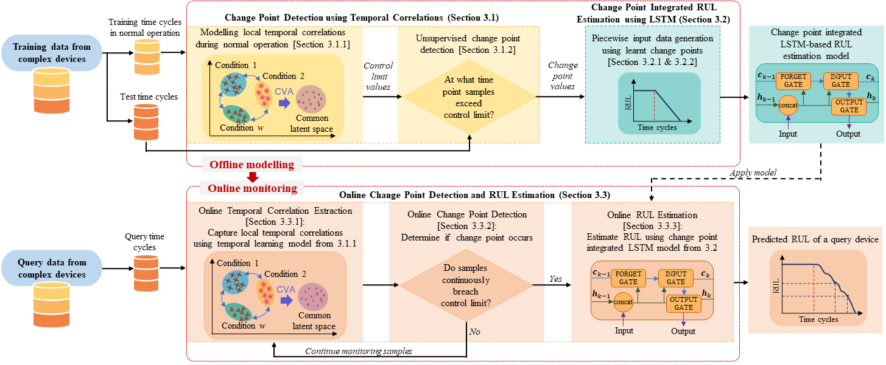

# A change point detection integrated remaining useful life estimation model under variable operating conditions [[Paper]](https://www.sciencedirect.com/science/article/pii/S0967066123004094) [[Cite]]()
by Anushiya Arunan, Yan Qin, Xiaoli Li, Yuen Chau

## Abstract

By informing the onset of the degradation process, health status evaluation serves as a significant preliminary step for reliable remaining useful life (RUL) estimation of complex equipment. However, existing works rely on a priori knowledge to roughly identify the starting time of degradation, termed the change point, which overlooks individual degradation characteristics of devices working in variable operating conditions. Consequently, reliable RUL estimation for devices under variable operating conditions is challenging as different devices exhibit heterogeneous and frequently changing degradation dynamics. This paper proposes a novel temporal dynamics learning-based model for detecting change points of individual devices, even under variable operating conditions, and utilises the learnt change points to improve the RUL estimation accuracy. Using C-MAPSS turbofan engines as the case study, the proposed method improved the accuracy by 5.6% and 7.5% for two scenarios with six operating conditions, when compared to existing LSTM-based RUL estimation models that do not consider heterogeneous change points.

## Code
This is a Tensorflow implementation. A minimum working example dataset (FD01) is provided in CMAPSSData folder. For the complete dataset, please access it via [Saxena et. al](https://ieeexplore.ieee.org/document/4711414). 

To train and evaluate the change point detection and RUL estimation model, run train.py.

##
